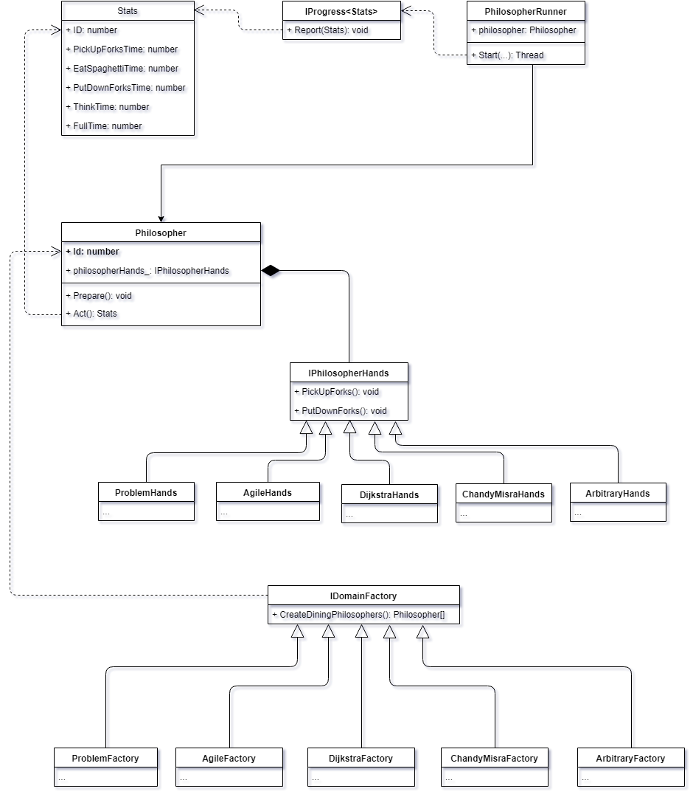
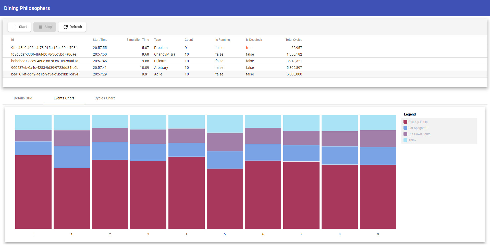

# Dining Philisophers

App simulates and visualize [Dining philosophers problem] and uses different algorithms to resolve deadlock. Backend is built using ASP.NET Core Web API and frontend is an Angular SPA.

Technologies used:

* ASP .Net Core Web API
* Angular
* Redis
* WebSocket
* Docker

## How to

### ... run in Docker

To start with single API server follow these steps:

1. Install or make sure Docker is running locally (e.g., check `docker version`).
2. Run `docker-compose up -d`
3. Go to http://localhost

To start with multiple API servers and load balancer run `docker-compose up -d --scale dp_webapi=3`.

### ... run locally

1. Make sure you have .NET Core SDK 2.1 installed (`dotnet --version`)
2. Make sure you have Node.JS installed (`node -v`)
3. Build and run backend: 
  * `dotnet run --project ".\DiningPhilosophers.WebApi\DiningPhilosophers.WebApi.csproj"`
4. Build and run frontend (in folder 'DiningPhilosophers.WebClient'):
  * `npm i`
  * `ng serve`
5. Go to http://localhost:4200

## Folder structure

* **DiningPhilosophers** - interactive console application to simulate and run single selected algorithm and provide statistics
* **DiningPhilosophers.Core** - dining philosophers domain model library
* **DiningPhilosophers.Sim** - simulation model, services and abstractions library
* **DiningPhilosophers.Utils** - shared utilities library
* **DiningPhilosophers.WebApi** - Web API server application
* **DiningPhilosophers.WebClient** - Web client application

## Domain Model

## Screenshots

[Dining philosophers problem]: https://en.wikipedia.org/wiki/Dining_philosophers_problem